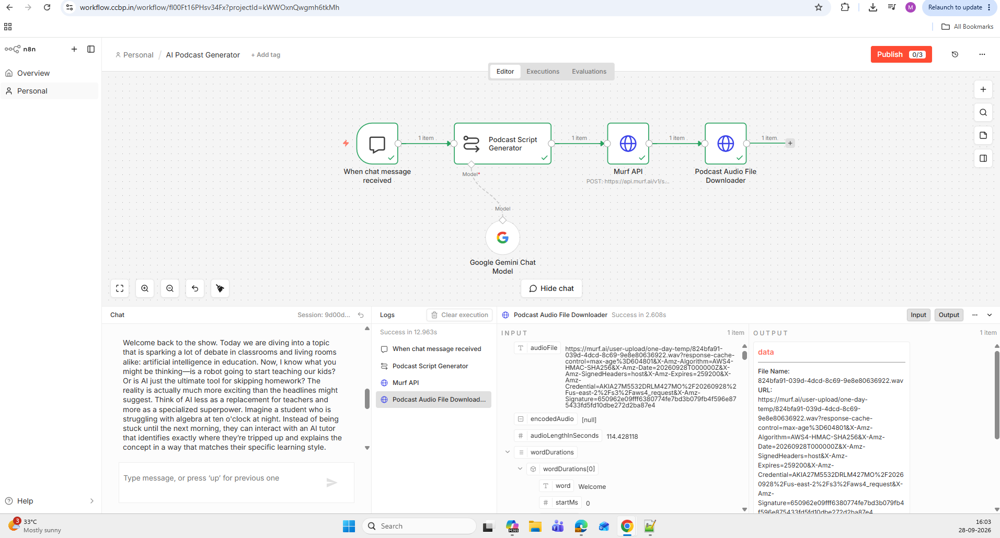
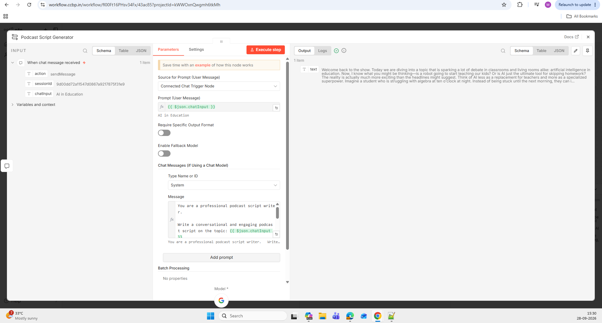
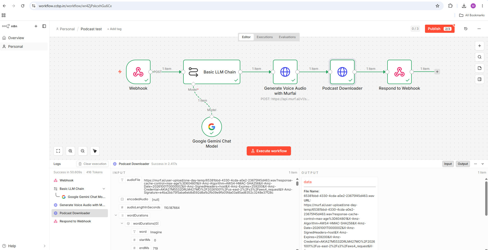
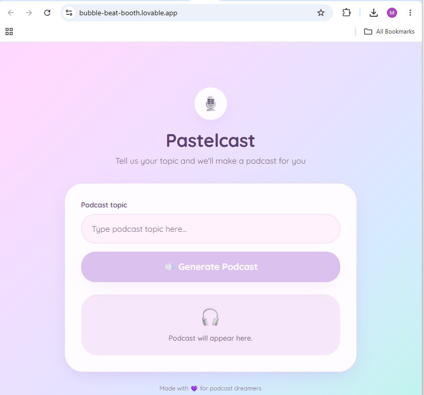

# AI Podcast Generator Platform

An AI-powered podcast generation platform that transforms user-provided topics into professionally narrated podcast-style audio episodes using Google AI Studio, Google Gemini, Murf AI, n8n, and a browser-based frontend application.

## Live Demo

🔗 https://bubble-beat-booth.lovable.app

---

## Overview

This project automates podcast creation using Generative AI and Text-to-Speech technologies.

The project started as an n8n-based workflow that generated podcast audio through a chat interface.

It was later enhanced with a browser-based frontend application built using Lovable and integrated with the workflow using webhooks, transforming the solution into a complete AI-powered podcast generation platform.

Users can now:

- Enter a podcast topic through a web interface
- Trigger workflow execution through a webhook
- Generate AI-created podcast scripts
- Convert scripts into natural-sounding speech
- Listen to generated podcasts directly in the browser

The result is a fully automated end-to-end podcast generation platform.

---

## Major Enhancement (Version 2)

### Version 1

The original implementation operated through the n8n Chat Trigger interface.

Users had to interact directly with the workflow to generate podcasts.

### Version 2

The project was significantly enhanced by introducing:

- Browser-based frontend application
- Webhook-based workflow triggering
- Frontend-to-n8n integration
- Browser audio playback
- Automated response handling
- Public deployment

This transformed the solution from an internal workflow automation into a publicly accessible AI-powered application.

Users no longer need direct access to n8n to generate podcasts.

---

## Problem Statement

Creating podcast content traditionally involves:

- Researching a topic
- Writing a script
- Recording narration
- Editing audio
- Exporting final podcast files

This process can take hours for a single episode.

This project automates the workflow using AI-powered content generation and text-to-speech synthesis, significantly reducing content creation effort and production time.

---

## Key Features

### Version 1 Features

- Chat-based topic input
- AI-generated podcast script creation
- Google AI Studio integration
- Google Gemini integration
- Murf AI text-to-speech conversion
- Natural-sounding podcast narration
- Automated audio generation
- Automated audio download
- End-to-end workflow automation

### Version 2 Features

- Public web application
- Responsive user interface
- Webhook-based workflow triggering
- Frontend-to-workflow integration
- Browser audio playback
- Real-time request handling
- Public deployment
- Improved user experience

---

## Project Evolution

### Version 1

```text
User
  ↓
Chat Trigger
  ↓
Google Gemini
  ↓
Murf AI
  ↓
Generated Audio
```

### Version 2

```text
User
  ↓
Frontend Application
  ↓
Webhook
  ↓
n8n Workflow
  ↓
Google Gemini
  ↓
Murf AI
  ↓
Respond to Webhook
  ↓
Browser Audio Player
```

---

## Architecture (Version 2)

```text
User
  ↓
Frontend Application (Lovable)
  ↓
Webhook
  ↓
n8n Workflow
  ↓
Google Gemini
Podcast Script Generation
  ↓
Murf AI
Text-to-Speech Generation
  ↓
Generated Audio
  ↓
Respond to Webhook
  ↓
Browser Audio Player
```

---

## Detailed Technical Architecture

```text
┌──────────────────────────────┐
│ Browser User                 │
└─────────────┬────────────────┘
              │
              ▼
┌──────────────────────────────┐
│ Lovable Frontend             │
│ Podcast UI                   │
└─────────────┬────────────────┘
              │
              ▼
┌──────────────────────────────┐
│ Webhook Trigger              │
└─────────────┬────────────────┘
              │
              ▼
┌──────────────────────────────┐
│ Google Gemini                │
│ Podcast Script Generator     │
└─────────────┬────────────────┘
              │
              ▼
┌──────────────────────────────┐
│ Murf AI API                  │
│ Text-to-Speech Generation    │
└─────────────┬────────────────┘
              │
              ▼
┌──────────────────────────────┐
│ Audio Downloader             │
└─────────────┬────────────────┘
              │
              ▼
┌──────────────────────────────┐
│ Respond to Webhook           │
└─────────────┬────────────────┘
              │
              ▼
┌──────────────────────────────┐
│ Browser Audio Player         │
└──────────────────────────────┘
```

---

## Technologies Used

### Artificial Intelligence

- Google AI Studio
- Google Gemini
- Prompt Engineering
- Generative AI

### Audio Generation

- Murf AI
- Text-to-Speech (TTS)

### Frontend

- Lovable
- React
- TypeScript
- Vite

### Automation

- n8n
- Workflow Automation

### APIs & Integrations

- Google Gemini API
- Murf AI API
- Webhooks
- HTTP Request Nodes

### Deployment

- Lovable Deployment Platform

---

## Engineering Highlights

- Built an AI-powered podcast generation workflow using n8n
- Created and configured a dedicated Google AI Studio project
- Generated and managed Gemini API credentials
- Integrated Google Gemini with n8n using secure API authentication
- Automated podcast script generation using Google Gemini
- Integrated Murf AI for realistic voice synthesis
- Implemented REST API-based text-to-speech generation
- Configured binary audio downloads in n8n
- Designed an end-to-end text-to-audio automation pipeline
- Replaced Chat Trigger architecture with Webhook architecture
- Built and integrated a browser-based frontend using Lovable
- Implemented frontend-to-workflow communication
- Added browser audio playback capabilities
- Published a public-facing AI podcast generation application

---

## How It Works

1. User enters a podcast topic through the browser interface.
2. The frontend sends the topic to an n8n webhook.
3. Google Gemini generates a podcast-style script.
4. Murf AI converts the generated script into natural-sounding speech.
5. Murf AI returns an audio URL.
6. The workflow downloads the generated audio.
7. The generated podcast is returned to the frontend.
8. Users can listen directly from the browser.

---

## Challenges Faced

### Google AI Studio & Gemini

- Creating a dedicated Google AI Studio project
- Generating Gemini API credentials
- Connecting Gemini with n8n
- Prompt engineering for podcast script generation

### Murf AI Integration

- API authentication setup
- Text-to-speech endpoint configuration
- Voice selection and testing
- Audio generation workflow configuration

### Webhook Integration

- Replacing Chat Trigger architecture
- Frontend-to-workflow communication
- Request and response handling
- Error handling implementation

### Workflow Design

- Passing generated content between nodes
- Binary file handling
- Audio file downloads
- End-to-end workflow testing

---

## What I Learned

- Workflow Orchestration using n8n
- Google AI Studio Setup
- Gemini API Key Generation and Management
- Google Gemini Integration
- Prompt Engineering
- Murf AI Integration
- Text-to-Speech Generation
- React Frontend Integration
- Webhook Architecture
- HTTP Request Configuration
- Binary Data Handling
- API Authentication and Credential Management
- End-to-End AI Automation
- Frontend to Workflow Communication

---

## Repository Structure

```text
AI-Podcast-Generator
│
├── frontend/
│   ├── src/
│   ├── public/
│   └── React frontend application
│
├── workflows/
│   ├── podcast-generator-v1.json
│   └── podcast-generator-v2-webhook.json
│
├── screenshots/
│
├── sample-podcast.wav
│
└── README.md
```

---

## Screenshots

### Workflow Overview — Version 1



The original n8n workflow orchestrates the podcast generation pipeline using a Chat Trigger, Google Gemini, Murf AI, and audio download functionality.

---

### Generated Podcast Script



Google Gemini generates the podcast script based on the topic provided through the chat interface.

---

### Workflow Overview — Version 2



The enhanced workflow uses a Webhook Trigger, frontend integration, Google Gemini, Murf AI, audio download, and Respond to Webhook architecture.

---

### Public Web Application



The browser-based frontend application allows users to generate AI-powered podcasts without directly accessing n8n.

---

## Sample Output

The following WAV file is the final podcast generated by the workflow:

**[Listen to the generated podcast](sample-podcast.wav)**

The audio was automatically generated using Google Gemini for script generation and Murf AI for text-to-speech synthesis.

---

## Project Impact

- Eliminates manual script creation
- Reduces podcast production effort
- Automates text-to-audio conversion
- Demonstrates practical AI audio generation
- Demonstrates frontend-to-backend integration
- Demonstrates webhook-based workflow automation
- Converts workflow automation into a user-facing application
- Converts simple user prompts into narrated podcast content
- Demonstrates integration of Generative AI, TTS, frontend engineering, and automation technologies

---

## Future Improvements

- Multi-speaker podcast conversations
- Voice selection options
- Background music integration
- Podcast publishing automation
- Transcript generation
- Multi-language podcast generation
- Podcast series creation
- Custom voice cloning support
- User authentication
- Podcast history management

---

## Security

No API keys, OAuth credentials, authentication tokens, or secrets are stored in this repository.

All credentials are managed securely through n8n credential management and external service providers.

---
